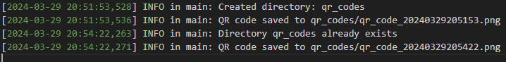

# QR Code Generator

=================

## Project Description

-------------------

This project combines the power of Docker and Python to create a simple, efficient, and lightweight QR code generator. It generates a QR code as a PNG file containing a URL. When scanned with a phone camera, the QR code directs the user to a specified website, in this case, a GitHub homepage.

## Features

--------

-   Generate QR Code: Automatically generates a QR code containing the URL to your GitHub homepage.

-   Docker Integration: Ensures consistent running environments and easy deployment.

-   Simple and Efficient: A user-friendly interface that performs efficiently.

## Getting Started

---------------

These instructions will get you a copy of the project up and running on your local machine for development and testing purposes.

### Prerequisites

-   Docker

-   Git (optional, for cloning the repository)

### Installation

1\.  Clone the Repository (Optional):

    If you have Git installed, you can clone the repository using the following command:

    `git clone https://github.com/njitmani/Assignment7`

    Alternatively, you can download the ZIP file of the project and extract it.

2\.  Copy content of `.env.sample` file to `.env` file.

3\.  Build the Docker Container:

    Navigate to the project directory and build the Docker container using the following command:

    `docker build -t qr-code-generator .`

    This command builds a Docker image named `qr-code-generator` based on the Dockerfile in the current directory.

4\.  Run the Docker Container:

    After building the image, run the container using:

    `docker run --name qr-generator -d qr-code-generator`

    This command runs the container in detached mode.

    Additionally, if you want to change to color of the QR Code, then use:

    `docker run --name qr-code-generator -e QR_FILL_COLOR=blue -e QR_BACK_COLOR=yellow -d qr-code-generator`

    The QR code generated will have the fill color as blue and background color yellow.

### QR Code

The following is a sample QR code with blue fill color and white background.

Scanning the QR code with the hpone will take you to the `https://github.com/njitmani/Assignment7`.

### Logging

Additionally logging is included in the code.

The following is a sample log message:

